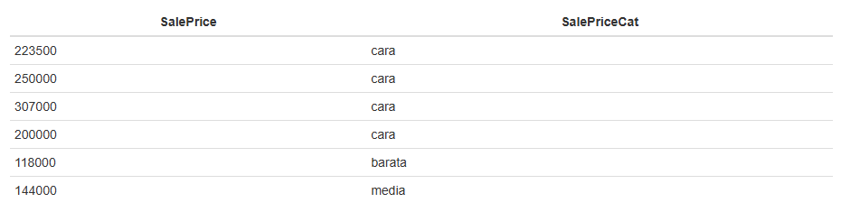
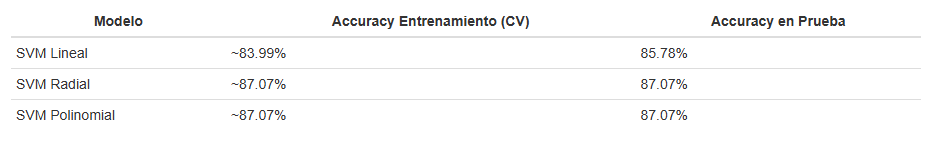
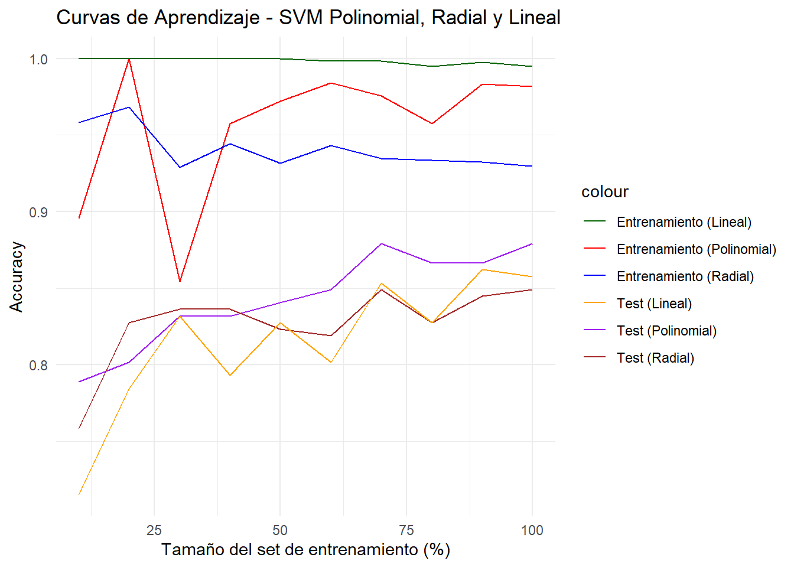
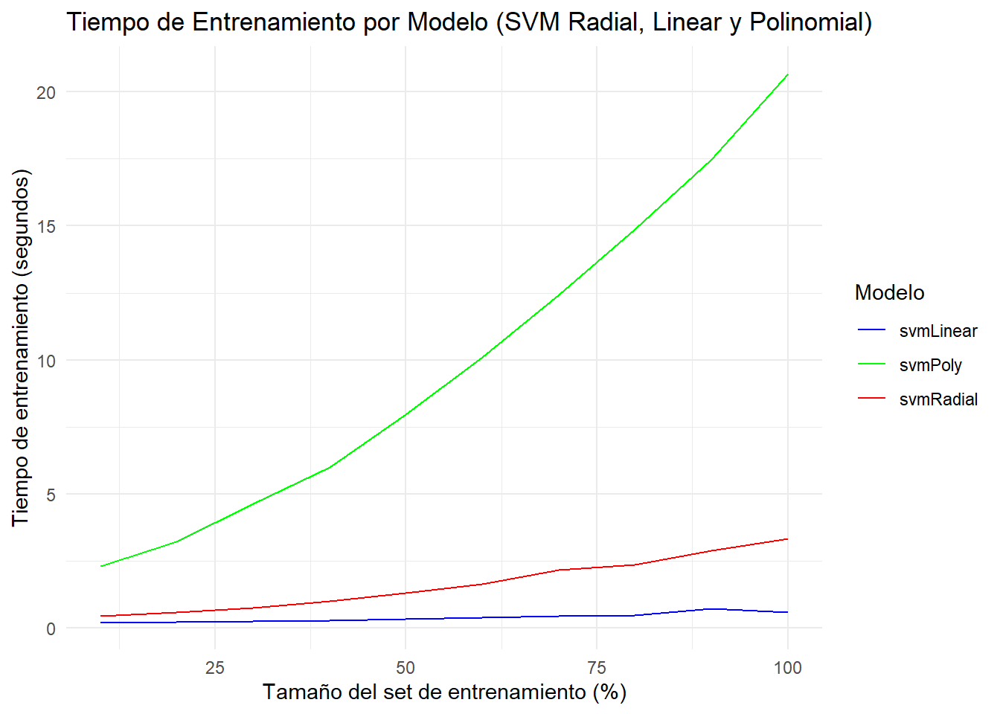
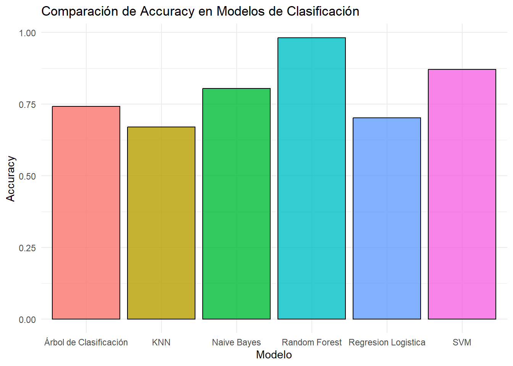
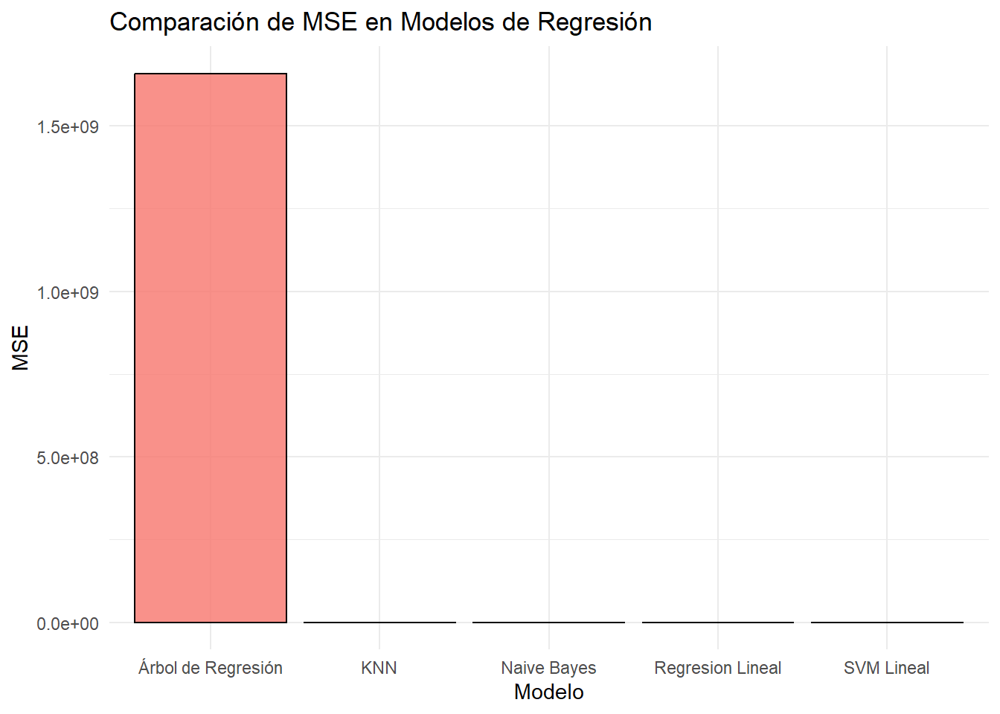

# Máquinas Vectoriales de Soporte Informe Parte 12

## 1. Resumen Ejecutivo
La empresa ha decidido incorporar un equipo de analistas de datos con la finalidad de trabajar con
el conjunto de datos "House Prices: Advanced Regression Techniques" para desarrollar modelos
predictivos que proyecten de manera precisa el precio de las viviendas. Mediante el análisis de
variables clave como la ubicación, el tamaño y la calidad de las propiedades, el equipo utilizará
técnicas avanzadas de regresión para mejorar la estimación de valores inmobiliarios y facilitar la
toma de decisiones estratégicas en el mercado de bienes raíces

## 2. Introducción

El enfoque principal será el desarrollo de modelos predictivos robustos que permitan proyectar el precio de las viviendas de manera fiable, a partir del análisis de variables determinantes como la ubicación, el tamaño, y la calidad de las propiedades. Para alcanzar este objetivo, se implementarán técnicas avanzadas de Machine Learning, en particular Máquinas de Vectores de Soporte (SVM).

El modelo SVM será empleado en dos frentes: en primer lugar, para clasificar las propiedades en distintas categorías de precio; y en segundo lugar, para predecir de manera continua el valor específico de cada vivienda. Esta metodología permitirá no solo una segmentación más precisa del mercado, sino también una mejor orientación en las estrategias de compra, venta y valorización de activos inmobiliarios.

## 3. Resultados

**Tabla 1. Categoria y rango de precios para las casas"**

**Tabla 2. Resumen de Rendimiento de modelos SVM**

**Figura 1. Curva de Aprendizaje para todos los modelos SVM**

**Figura 2. Tiempo de Ejecucion por modelo en SVM**

**Figura 3. Comparacion de Accurancy  de los modelos de clasificacion para la variable SalesCat**

**Figura 5. Comparacion de Accurancy  de los modelos de regresion para la variable SalesPrice**

## 4 Discusión

Se puede observar que al utilizar SVM de entre las 3 de la tabla 2 la mejor fue la de polinomial, de hecho se presenta que en la curva de aprendizaje de las 3 es la que mejor tiene rendimiento.

La curva de aprendizaje de la figura 1 enseña que ninguna de los modelos esta sobreajustado, aunque si pueden tener cierto subajuste, pero comparando con su test el mejor es sin duda polinomial, debido a que es donde las 2 curvas tienden a tener un mismo accurancy entre los datos de prueba y de testeo. Posiblemente porque el modelo polinomial al cambiar a una dimension mas grande genera mas ajuste que el lineal y el readial

A pesar de ello no es muy buen modelo por su crecimiento en el factor de tiempo visto en la grafica 3, de hecho es perferible el lineal o el radial porque si bien son peores en accurancy , la verdad es que no hay mucha diferencia entre los 3. Y esto puede ser porque las variables estan bien divididas en los grupos que deberian de ser.

Al usar el polinomial como punto de comparacion viendo que es mejor que los anteriores vemos que a diferencia de los demas modelos de clasificacion fue bastante bueno, de hecho es el mejor sin contar al random Forest como se ve en la figura 3 , pero al analizarlo con los de regresion  de la figura 4 es bastante malo, pero mejor que el de arboles de regresion. 

Como vimos si bien polinomial hace muy buen ajuste con train y test, muy posiblemente con mas datos pueda haber un sobreajuste , por lo que se recomienda usar el kernel lineal asi no se llevara tanto tiempo.

## 5. Conclusiones
- El modelo lineal es mejor para datos enormes que la regresion polinomial.

- La SVM es bastante bueno rindiendo en clasificacion pero no en regresion , asi que no se recomienda su uso.

---

**Fecha:** Guatemala 27 de Abril 2024
**Autor(es):** 
- Pablo Daniel Barillas Moreno, Carné No. 22193

- Mathew Cordero Aquino, Carné No. 22982

